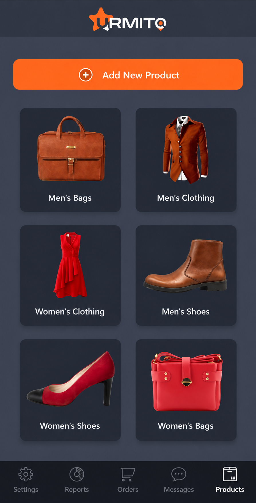
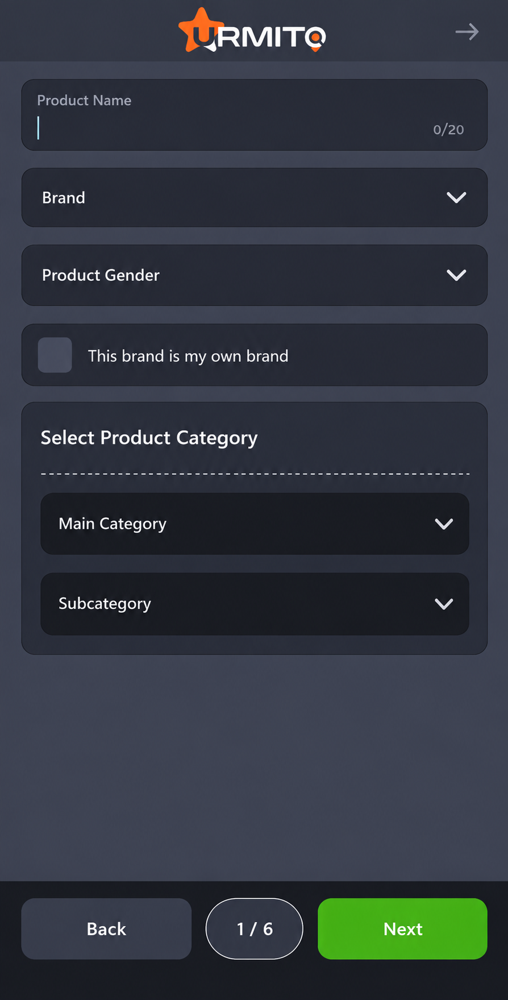
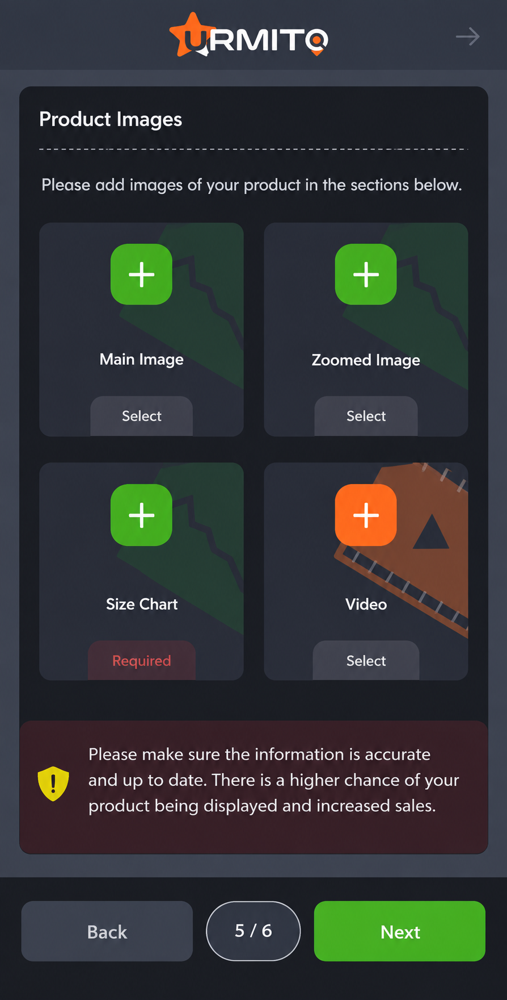
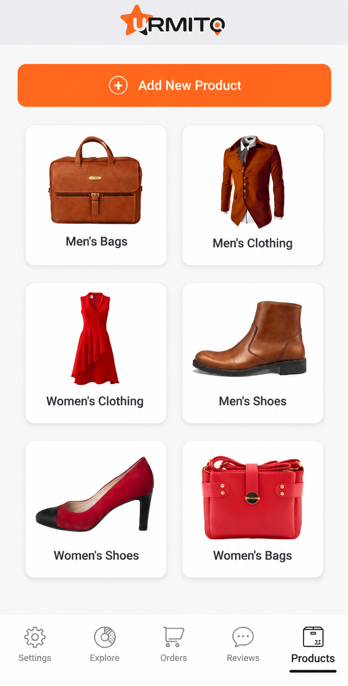
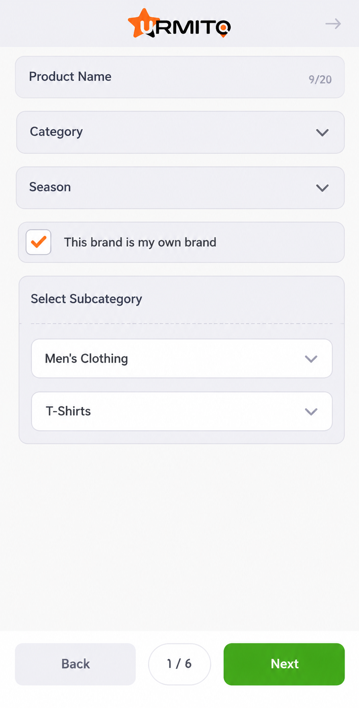
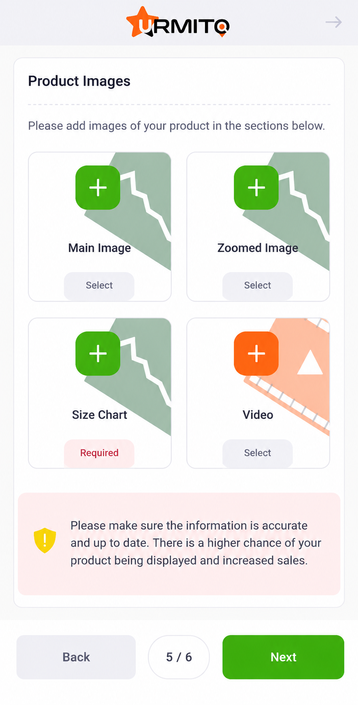
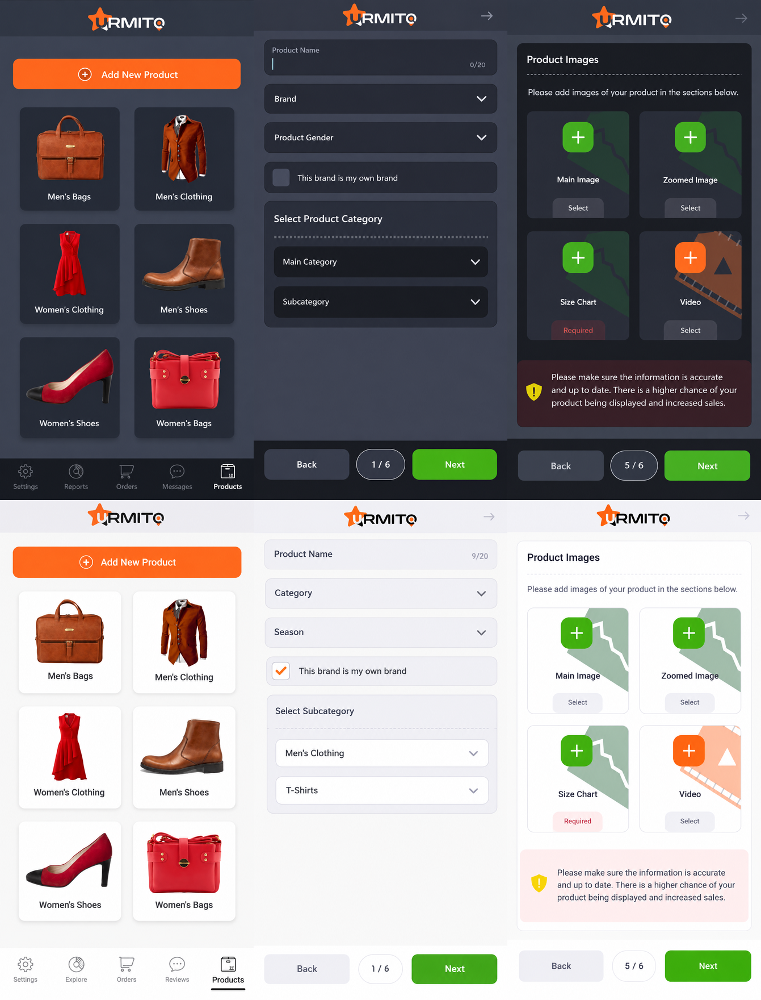
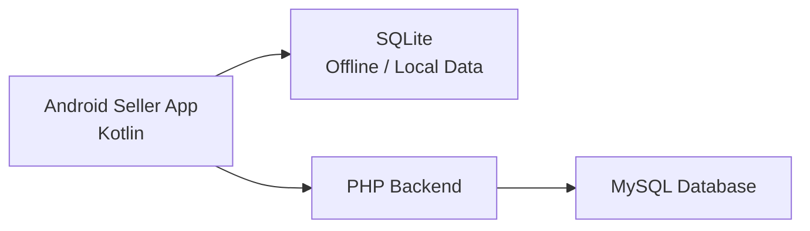

# URMITO Seller App — Portfolio Showcase

URMITO Seller App is an Android marketplace project started in **2024** and currently under active development. It is designed for sellers who list clothing and related fashion accessories through the URMITO marketplace.

This repository is a **portfolio showcase**. It presents selected seller-side interfaces and workflows; the application source code is private and is not included here.

## Overview

The screenshots currently focus on part of the seller experience, including product management and the multi-step product listing flow. Some platform-specific features are still under development and are intentionally not presented yet.

The screenshots in this repository **do not represent every screen, feature, or module in the application**.

## Main Features Shown

- Seller product dashboard
- Multi-step product listing workflow
- Product name, brand, gender, category, and subcategory selection
- Product image and media submission
- Main image and zoomed-image fields
- Product size-chart submission
- Optional product video submission
- Light and dark interface themes
- Offline/local data storage with SQLite
- PHP backend with MySQL persistence

## Tech Stack

| Layer | Technology |
| --- | --- |
| Android application | Kotlin |
| Offline/local storage | SQLite |
| Backend | PHP |
| Server database | MySQL |

## Screenshots

### Dark Theme

  
  
  

### Light Theme

  
  
  

> The screenshots above are selected portfolio views only and do not cover the full application.

## Portfolio Overview

  

## Architecture

The Android client uses **SQLite** for local/offline data handling and communicates with a **PHP backend**, with server-side data stored in **MySQL**.

## Project Status

**Active Development — started in 2024**

The project is still evolving. Additional marketplace capabilities and platform-specific features are under development and are not included in this public showcase.

## Repository Status

This repository is intended solely as a **portfolio presentation**. The production source code, backend implementation, business logic, and unreleased features remain private.
